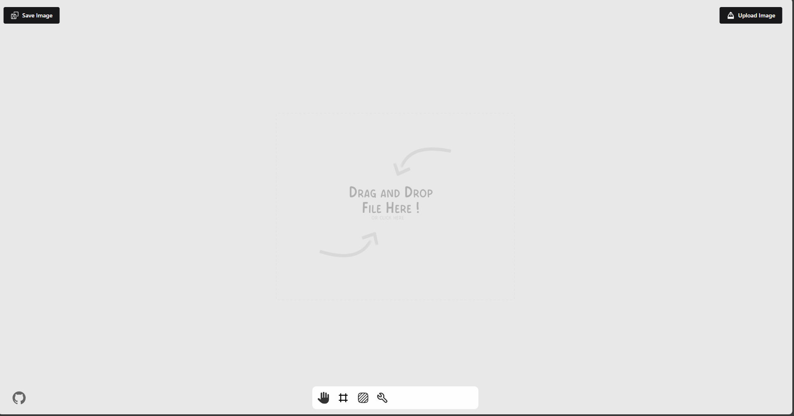
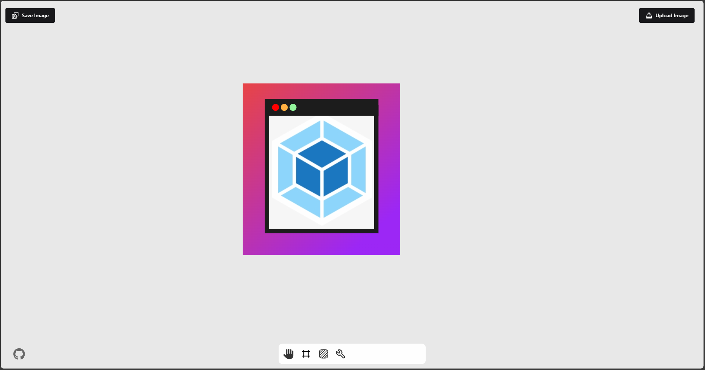
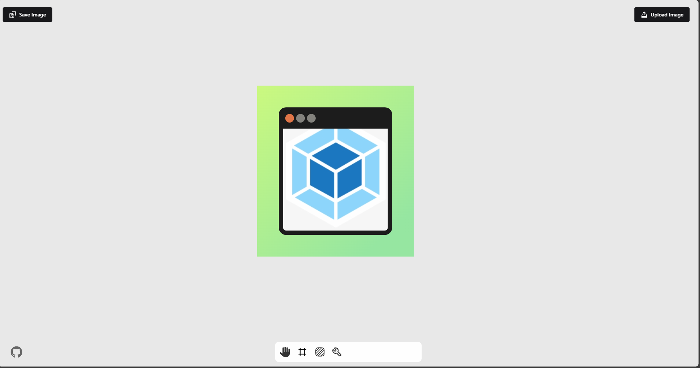
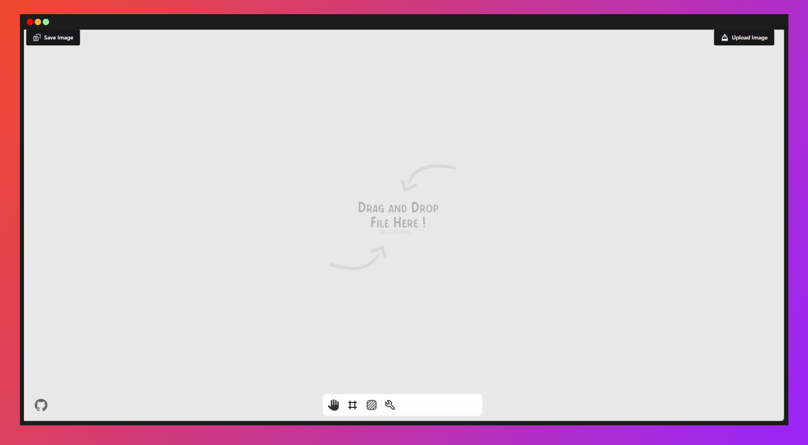

# Prettier Images

<p align="center">

</p>

- A very simple image editor to help you create can add some borders and background for your images.

## Features

- Add borders to your images
- Add background colors
- Drag and drop to reposition your image
- Zoom in and out of your image
- Export as PNG

## Tech Stack

- React
- TypeScript
- Vite
- Zustand
- Konva

## Run Locally

- Clone the project

```bash
  git clone <url project>
```

- Go to the project directory

```bash
  cd prettier-images
```

- Install dependencies

```bash
  npm install
```

- Start the development server

```bash
  npm run dev
```

## Example Images





